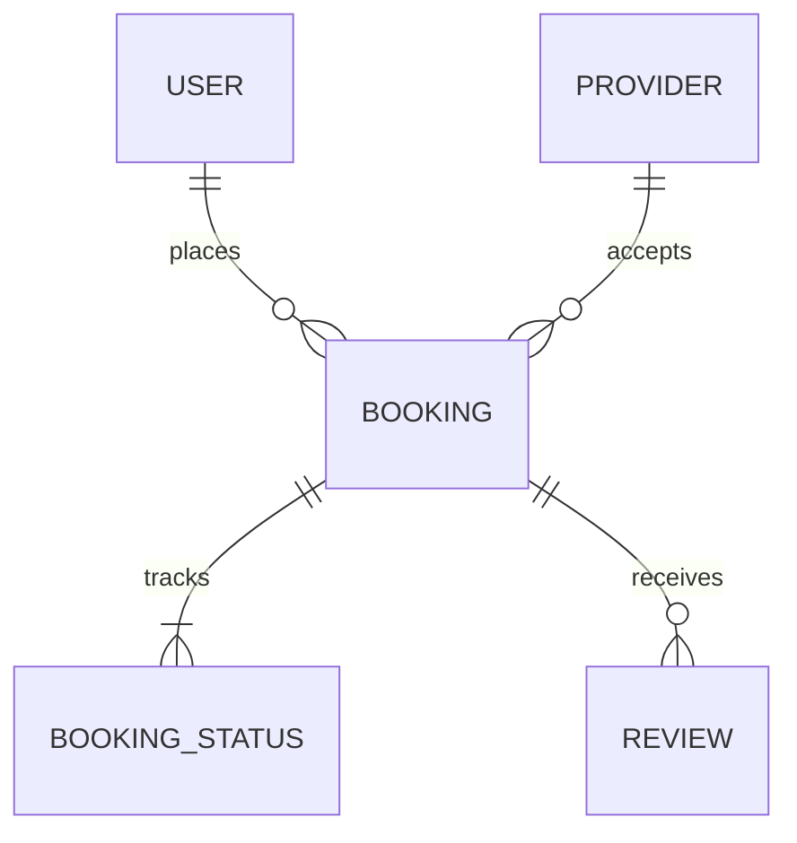

# AquaServe — Emergent AI Full-Stack App Specification

This document provides a structured, full-stack application specification optimized for **Emergent AI** (and other vibe-coding or multi-agent code generation platforms). 

Use this prompt to build the entire **AquaServe** Android/Web application, including routing, state management, UI, database models, and business logic.

---

## 1. Application Architecture & Core Roles

AquaServe is a water purifier servicing application with a single codebase that serves two distinct roles based on a user's initial selection:
1. **Service Needer (Client):** Needs purifier installation, filter changes, repairs, or maintenance.
2. **Service Provider (Technician/Partner):** Receives and fulfills nearby service bookings.

### Role Switching State
* On first launch, the app stores the selected role (`client` or `provider`) in persistent storage (e.g., LocalStorage / SQLite / AsyncStorage).
* Subsequence launches bypass the Role Selection screen and open directly to the role's corresponding dashboard.

---

## 2. Visual Design System (CSS/Style Tokens)

Emergent AI must implement the following design tokens using standard Tailwind config, CSS variables, or visual styles:

| Token Name | Value | Purpose |
|---|---|---|
| **Primary** | `#0B6E68` Deep Teal | Headers, active navigation states, primary branding elements |
| **Accent / CTA** | `#F5A623` Warm Amber | Highlight buttons, notifications, price tags, countdown timers |
| **Background** | `#F7FAF9` Soft Mist White | Outer screen canvas backgrounds |
| **Surface** | `#FFFFFF` | Cards, modal sheets, input wrappers |
| **Text Primary** | `#1F2937` Charcoal | Main titles, text headings, body content |
| **Text Secondary**| `#6B7280` Slate Gray | Subtext, timestamps, metadata labels |
| **Success** | `#2E9E6D` | Confirmed/Completed state indicators |
| **Error** | `#E5484D` | Cancelled states, validation errors, warnings |
| **Warning** | `#F5A623` | Pending state highlights, timer icons |

* **Typography:** Inter or Poppins. Semibold for headings, Regular for body text.
* **Corner Radius:** 16-20px on layout cards/sheets; 12px on buttons/inputs.
* **Shadows:** Subtle elevation (e.g., `shadow-sm` or custom low-opacity shadows) instead of hard borders.

---

## 3. Data Models & Application State

Emergent AI should scaffold mock APIs and local state around the following database schema concepts:

* **User/Provider Session:** Holds current user's profile, registration role, verified location coordinates, and document upload status.
* **Booking State:**
  * `id`: Unique booking string.
  * `service_type`: Installation / Filter Change / Repair / AMC / General Service.
  * `status`: `Confirmed` | `Assigned` | `On the Way` | `In Progress` | `Completed` | `Cancelled`.
  * `otp`: 4-digit numeric string generated upon assignment.
  * `otp_attempts`: Integer (Max 3 retries).
  * `created_at`: Datetime stamp.
  * `scheduled_time`: Selected date & time slot.
  * `price_details`: Subtotal, visit fee, tax, and final amount.
  * `payment_method`: `COD` (Cash on Delivery) | `UPI`.
  * `payment_status`: `Pending` | `Paid` | `Disputed`.
* **Provider Availability Toggle:** Boolean (`true` = Online, `false` = Offline).

---

## 4. Shared Onboarding Flows (Auth & Permissions)

### A1. Splash Screen
* **UI:** Centered, premium logo (a water drop combined with a wrench icon) on a `#0B6E68` Deep Teal background. Tagline "Servicing you can trust" in a lighter teal tint below.
* **Behavior:** Auto-transitions to **A2** after 1.5 seconds.

### A2. Role Selection Screen
* **UI:** Soft mist-white canvas. Heading: "How would you like to continue?". Two vertical cards:
  1. "I need a service" (Client - home icon)
  2. "I provide service" (Technician - toolbox icon)
* **Behavior:** Clicking a card sets the user role in global state and navigates to Login (A3).

### A3. Login / OTP Verification Screen
* **UI:** Rounded input field pre-filled with country code (`+91`) for mobile number. Amber button "Send OTP".
* **State Behavior:**
  * Tapping "Send OTP" slides in a 4-digit code entry form.
  * Displays "Resend OTP in 00:30" countdown.
  * Teal "Verify" button transitions to **A4** (new client), **A5** (new provider), or direct home screen if user is pre-registered.

### A4. New User Details (Client Profile Setup)
* **UI:** Input fields: Full Name, Email (optional). Teal "Continue" button.
* **Behavior:** Saves client details and forwards to location permissions (A6).

### A5. New Provider Details (Technician Profile Setup)
* **UI:** Input fields: Full Name, locality area. Selection chips for service categories. Upload placeholder card for ID Proof.
* **Behavior:** Saves details as "Pending Approval" and routes to location permissions (A6).

### A6. Location Permission Screen
* **UI:** Graphic map pin over a stylized neighborhood. Large heading: "Enable your location". Sub-text explaining it is used to find nearby services or technicians.
* **Behavior:** Primary Amber button "Allow Location Access" triggers browser/system location prompt. Secondary text link "Enter address manually" reveals address form inputs.

---

## 5. Service Needer (Client) App Flow

### B1. Dashboard / Home Screen
* **Layout:** Bottom Navigation visible (active tab: **Home**).
* **UI Elements:**
  * Header: Current location pin text + Notification bell icon + logo.
  * Search bar: Placeholder "Search for RO service, filter change, repair…".
  * Horizontal carousel banner showing current offers (e.g., "Filter change starting ₹499").
  * Category grid: Installation, Filter Change, Repair, AMC, General Service.
  * "Service providers near you" scroll: Horizontal cards showcasing name, star ratings, distance, and starting price.
  * Active Booking Widget: Highlighted banner showing active booking status if a job is in progress.

### B2. Service Details Screen
* **UI:** Banner image, service title, price tag in Amber, duration tag, "What's included" list.
* **Actions:** "Add to Cart" triggers badge count increments; "Book Now" bypasses cart directly to checkout. Wishlist heart toggle.

### B3. Cart Screen
* **UI:** List of selected items, quantity selectors (`+` / `-`), pricing breakdown (Subtotal, Visit fee, taxes, total).
* **Actions:** Sticky bottom button "Proceed to Checkout". Bottom nav active on **Cart**.

### B4. Checkout Screen
* **UI:** Vertically stacked card layout:
  1. Date picker strip (horizontal date carousel).
  2. Time slot selector (Morning, Afternoon, Evening chips).
  3. Address card (pre-filled, with edit icon).
  4. Notes field: text area for purifier model details.
  5. Billing summary.
  6. Payment selection: Radio buttons for "Cash on Delivery (COD)" and "UPI".
* **Actions:** Solid Amber button "Confirm Booking".

### B5. Booking Confirmation Screen
* **UI:** Success checkmark animation, Booking ID, and scheduled timeframe.
* **Actions:** Teal "View Booking" routes to **B6/B7**; link "Back to Home" resets state.

### B6. Bookings List Screen
* **UI:** Segmented control tabs: **Upcoming** and **Past**.
  * **Upcoming:** Active status steps indicator (Confirmed → Assigned → On the way → In progress → Completed). Card lists service type, provider details (name, photo), and a Call icon. No chat icons.
  * **Past:** Details of completed services with a "Rate & Review" button and a "Book Again" button.
* **Navigation:** Bottom nav active on **Bookings**.

### B7. Booking Tracking Screen
* **UI:** Vertical step timeline displaying timestamped events. Mini card of assigned provider with photo, rating, and Call action.
* **Cancellation Business Rule:**
  * "Cancel Booking" action button.
  * If cancellation is attempted within 30 minutes of booking, allow free cancellation. If after 30 minutes, display warning popup of cancellation fees.

### B8. OTP Display Screen
* **UI:** Centered visual card with a large 4-digit code shown in bold Amber numbers.
* **System Logic:** Explicit instructions: "Share this code with your technician to start service." Code is shared offline to verify the physical arrival of the technician.

### B9. Service Completed / Payment Confirmation Screen
* **UI:** Success completion check.
* **Payment State Processing:**
  * If Payment Method was **COD**: Displays button "Confirm Cash Payment" for the client, or "Pay via UPI QR Code" which prompts provider to display the Razorpay UPI QR.
  * If **UPI** was selected at checkout: Initiates Razorpay UPI payment flow.

### B10. Rating & Feedback Screen
* **UI:** 5-star rating stars (interactive selection), quick-feedback chips ("Punctual," "Professional," "Quality Work"), text feedback box, and an Amber "Submit Feedback" button.

### B11. Account / Settings Screen
* **UI:** Profile picture, name, mobile number.
* **Menu list:** Saved Addresses, Payments, wishlist, Notifications, **Help & Support (routes to static contact options: WhatsApp contact link & Email support details)**, Privacy, and a Logout action. Bottom nav active on **Account**.

---

## 6. Service Provider (Technician) App Flow

### C1. Jobs / Home Screen (Provider Dashboard)
* **UI Elements:**
  * Header: Online/Offline status switch (turns green and says "Online" when toggled on).
  * Metrics card: Today's jobs counter, next schedule slot.
* **Dynamic Job Request Overlay:**
  * Triggers when a new job is available nearby.
  * Shows: Service type, Client's general locality, schedule time, and estimated payout.
  * **Interactive Countdown:** Display a visual 2-minute circular timer. If timer expires without action, auto-rejects and assigns to the next provider.
  * Action buttons: Teal "Accept", Outlined Gray "Reject".

### C2. Schedule Tab Screen
* **UI:** Tabs for **Today**, **Upcoming**, and **Completed**. Displays lists of job cards detailing time, service type, client name, and progress status badge. Bottom nav active on **Schedule**.

### C3. Job Details Screen (Provider View)
* **UI:** Client's name, phone dialer shortcut button. No chat icons. Deep link "Navigate" button opens address in Google Maps.
* **Sequenced Action Stepper:**
  * Renders active button corresponding to workflow state: **Start Journey** → **Mark Arrived** → **Enter OTP** → **Start Service** → **Mark Complete**.
  * Clicking "Mark Arrived" prompts the customer to display their OTP.

### C4. OTP Verification Screen (Provider View)
* **UI:** 4-digit passcode inputs. Verification button.
* **Error Handling Logic:**
  * If OTP input does not match booking OTP, display error text "Invalid OTP".
  * Increment error attempts counter. If attempts equal 3, block verification and prompt user to "Request Resend" from customer.

### C5. Payment Collection Screen
* **UI:** Job summary page displaying total amount due.
* **Payment Methods Setup:**
  * Primary Button: "Mark Cash Collected" (updates state to paid).
  * Secondary Button: "Show Razorpay UPI QR Code". Selecting this generates and renders a dynamic QR code pre-filled with the exact booking price, allowing customers to pay the provider via UPI.

### C6. Earnings Screen
* **UI:** Row of cards for "Today", "This Week", and "This Month" showing earnings stats. Table listing history of jobs, completed dates, earnings, and payment mode icons. Bottom nav active on **Earnings**.

### C7. Account / Profile Screen (Provider View)
* **UI:** Provider details, categories, verified badge.
* **Menu:** Documents/KYC settings, Ratings history, Service area range, **Help & Support (opens WhatsApp contact link and support email details)**, Logout button. Bottom nav active on **Account**.

### C8. Ratings & Reviews Screen
* **UI:** Global rating score, bar charts of reviews, scrollable list of rating comments from customers.

---

## 7. Interactive State Verification Rules (For Emergent AI Code Validation)

Ensure the generated code enforces and tests the following interactions:
1. **Role Separation:** Confirm that logging in as `client` never displays provider screens (e.g., job request notifications, schedule maps) and vice-versa.
2. **Help & Support Linkage:** Verify that clicking Help & Support on either client or provider profile navigates to a component showing both WhatsApp messaging and Email support options. No in-app chat screens exist.
3. **Acceptance Timeout:** Test the 2-minute timer on C1. Rejecting or timeout should remove the overlay.
4. **OTP Enforcement:** Ensure C3 stepper cannot advance past "Mark Arrived" until OTP is successfully validated via C4 (with a 3-try restriction).
5. **Razorpay Dynamic QR:** Confirm the payment flow on C5 generates a visual payment QR code matching the booking's exact total.